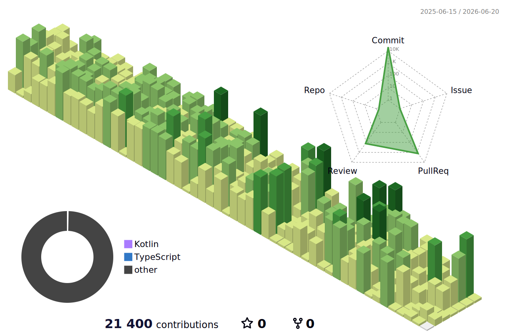

# J. Patrick Fulton

**CTO @ Lockbox AI, Inc.**

 &nbsp; patrick@lockboxai.com

---

Two decades as a hands-on engineer and technical leader — writing production code, designing distributed systems, and running engineering, QA, and DevOps organizations through high-growth phases. Most of my career has been in healthcare technology: revenue cycle, patient engagement, and contract management platforms. I know what it takes to migrate brittle legacy systems into cloud-native architectures, build and scale engineering teams 10x, and hold both the technical and the business problem in focus at the same time.

Healthtech has spent decades accepting an unconscionably low bar: flat-file exchange over SFTP, faxing as a primary data pathway, absent or unusable EDI standards, no REST API convention, and systems that are perpetually on-prem and perpetually "legacy." At Lockbox AI, we are throwing out that playbook entirely. Cloud-first, elastically scaled, cutting-edge modern architecture — built to a standard that would be considered ambitious in any vertical and is genuinely unprecedented in this one.

## What I'm Building

- **[Lockbox AI](https://lockboxai.com)** — AI-first RCM platform for post-acute care. Refusing to accept the architectural norms of a tech-backwards vertical: distributed, cloud-native, elastically scaled, built to a standard that has no precedent in the space. Current capabilities and near-term roadmap:
  - **ML-driven denial intelligence** — predictive scoring at documentation time, upstream of claim submission, catching failures before they happen rather than chasing them after
  - **Real-time claim analytics pipeline** — full-funnel visibility from documentation quality through collections; every account triaged and prioritized automatically
  - **EMR-native automation** — custom workflow automation built directly inside the provider's existing system (MatrixCare, KanTime, WellSky, Axxess); no new UI to learn, no parallel system to maintain
  - **Payer network intelligence** — cross-payer pattern recognition across denial types, turnaround benchmarks, and vendor performance; the independent accountability layer the market has never had
  - **Agent-driven workflow orchestration** — AI agents assigning, escalating, and closing work across internal staff and external billing vendors with full audit trail
  - **Open API architecture** — building the REST-first integration layer the vertical has refused to produce for thirty years
- **[Fulton Engineering Services](https://github.com/jpfulton-fultonengineeringservices)** — My personal LLC for open source, consulting, and technical writing. Separate identity, same engineer.

## Technical Focus

- AI-agent assisted engineering workflows — what I'm calling **harness engineering**
- Distributed systems design and cloud-native architecture on AWS
- Healthcare technology: RCM, patient engagement, and clinical data platforms
- Traditional ML and open weights model research
- Engineering organization leadership: hiring, architecture governance, IC-to-staff growth paths
- Upcoming OSS: SGLang, ONNX Runtime, AWS Redshift JDBC driver

## Also Find Me At

**[github.com/jpfulton-fultonengineeringservices](https://github.com/jpfulton-fultonengineeringservices)** — open source projects, technical writing, and consulting work under Fulton Engineering Services LLC.

---

